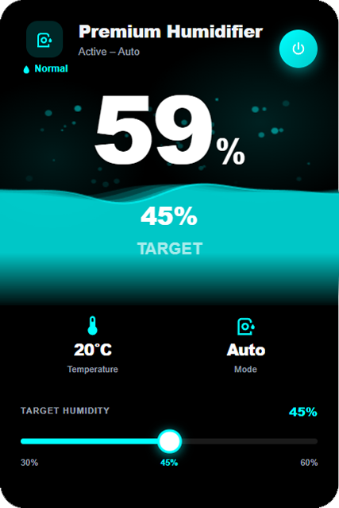

# Premium Humidifier Card

A premium, highly customizable humidifier card for Home Assistant. Designed to feel like a native app rather than a dashboard widget — with an animated water wave, steam particles, a target humidity slider and full UI configuration without any YAML.

## Features

🌊 **Animated Water Wave**
A canvas-based water wave fills the card and reacts to your tank level in real time. Multiple wave layers blend between your primary and secondary colors for a rich, fluid look.

💨 **Steam Particles**
Particles rise from the water surface when the humidifier is actively humidifying. Speed can be set manually or synced to the device.

💧 **Water Tank Level**
Supports both numeric sensors (0–100%) and text sensors (Empty / Low / Normal / Full). The wave height adjusts automatically to reflect how much water remains.

🎯 **Target Humidity Slider**
A smooth, touch-friendly slider to set target humidity directly from the card. Calls `humidifier.set_humidity` and syncs back to the entity state.

🎛️ **Dropdown Mode Selector**
Tap the mode tile to open a dropdown with all available modes. Supports a custom `input_select` entity for automation-driven workflows.

🌡️ **Sensor Stats**
Temperature and current mode are shown in a clean stat row below the wave. Boxes around the stats can be toggled off for a minimal look.

🎨 **Full Color Customization**
Primary color, secondary color, water colors, background colors and individual value colors are all configurable with color pickers. Card transparency can be set from 0 to 100 percent.

📏 **Adjustable Center Text Size**
Scale the humidity reading and target value in the center of the wave up or down to your preference.

🌍 **Multilingual**
The entire card and editor automatically adapts to your Home Assistant language. Supported languages: Swedish, English, German, French, Dutch, Norwegian, Danish, Finnish, Spanish and Polish.

🌙 **Auto Dark and Light Theme**
The card detects whether your background color is dark or light and adjusts all text and element colors automatically.

⚙️ **No YAML Required**
Everything is configured through a graphical editor. Entity pickers are filtered by domain and measurement unit so you always pick the right sensor.

## Installation

### Via HACS (Recommended)

1. Open HACS in your Home Assistant
2. Go to **Frontend**
3. Click the three dots in the top right and select **Custom repositories**
4. Add `https://github.com/griperik/premium-humidifier-card` with category **Dashboard**
5. Find **Premium Humidifier Card** in the list and install it
6. Reload your browser

### Manual

1. Download `premium-humidifier-card.js` from the latest release
2. Copy it to `/config/www/premium-humidifier-card.js`
3. Go to **Settings → Dashboards → Resources**
4. Add `/local/premium-humidifier-card.js` as a JavaScript module
5. Reload your browser

## Usage

1. Edit your dashboard
2. Click **Add card**
3. Search for **Premium Humidifier Card**
4. Configure your entities in the visual editor

## Configuration

All settings are available in the visual editor. No YAML needed.

| Setting | Description |
|---|---|
| Power entity | A humidifier or switch entity to toggle on/off |
| Humidity sensor | Extra sensor with % unit (optional if entity reports `current_humidity`) |
| Temperature sensor | Sensor with °C or °F unit |
| Tank sensor | Sensor reporting tank level in % or as text (Empty / Normal / Full) |
| Custom mode selector | Replace built-in modes with a custom `input_select` entity |
| Sync water level to tank | Wave height follows tank sensor value |
| Steam speed | 0 = no steam, 100 = fast |
| Center text size | Scale the humidity reading in the center of the wave |
| Card transparency | 0 = fully transparent, 100 = solid |
| Customize water colors | Set separate primary and secondary colors for the wave |
| Customize value colors | Set individual colors for each stat value |
| Center text color | Color of the humidity reading and target overlay text |

## Supported Languages

Swedish 🇸🇪 English 🇬🇧 German 🇩🇪 French 🇫🇷 Dutch 🇳🇱 Norwegian 🇳🇴 Danish 🇩🇰 Finnish 🇫🇮 Spanish 🇪🇸 Polish 🇵🇱

## Requirements

No external dependencies. No HACS plugins required. Just drop in the JS file and go.

## License

MIT License. See [LICENSE](LICENSE) for details.

## Contributing

Found a bug or have a feature request? Open an issue on GitHub. Pull requests are welcome!
